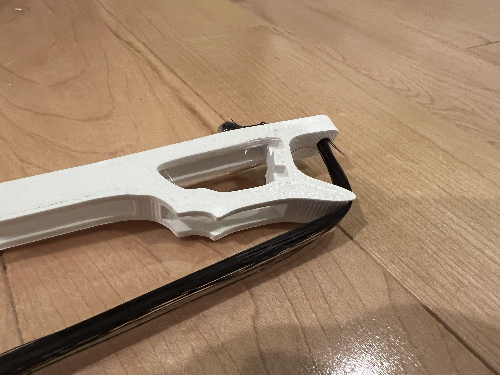

# 3D-printed-violin-bow  
## Prints I made for a bamboo violin bow and a fully 3D printed violin bow.  
### Bamboo Bow  
`violin-frog.stl`: Frog of the bamboo violin  
`violin-tip.stl`: Tip of the bamboo violin  
### 3D Printed Bow V1  
3D printed violin split into 4 parts joined with dovetail joints.  
`bow-part-1.stl`: Tip  
`bow-part-2.stl`: Upper half  
`bow-part-3.stl`: Lower half  
`bow-part-4.stl`: Frog  
### 3D Printed Bow V2  
`bow-part-1.stl`: Tip  
`bow-part-2.stl`: Upper half  
`bow-part-3.stl`: Lower half  
`bow-part-4.stl`: Frog  
## Images  
**Bamboo Bow**  
  
  

**3D Printed Bow Version 1 (heavily warped)**  
  
  

**Plastic welded the dovetail joints together using a dremel and printer filament**  
  

**3D Printed Bow Version 2 (snapped)**  
  
  
